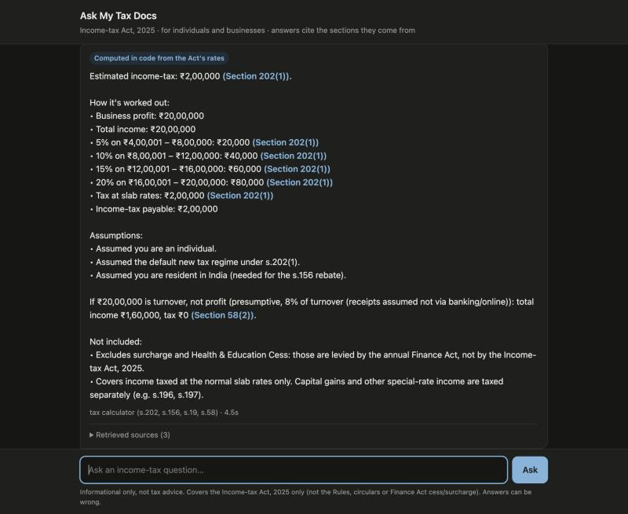

# RAG-Law — Ask My Tax Docs

A production-shaped RAG system over India's Income-tax Act, 2025 that answers
income-tax questions from individuals and businesses — and computes the tax
on a stated income — built to prove **retrieval quality engineering**, not
just "call an LLM." Runs entirely on a laptop with free, local models — no
API keys.



## The problem this solves

Naive vector-only RAG on legal text confidently retrieves the wrong or
superseded section — the answer still *reads* fluently, because retrieval
failures don't show up in fluency. A layperson asking "how much tax do I
owe?" and getting a confident wrong figure has real financial consequences.

It matters more than usual here: the Income-tax Act, 2025 replaced the 1961
Act and renumbered everything (the old "Section 80C" is now Section 123 +
Schedule XV). A general-purpose chatbot answering from training data can mix
the two Acts. This system answers only from the 2025 text, cites the
provision for every claim, computes tax in code rather than letting the LLM
do arithmetic, refuses when the retrieved text doesn't cover the question,
and has an eval that measures all of it.

## Results

From [`eval/run_eval.py`](eval/run_eval.py) on the 26-question test set
([`eval/testset.jsonl`](eval/testset.jsonl)), grounded in the Act's text:
17 questions across deductions, residence, salary, slab rates, the rebate,
presumptive taxation, house property and capital gains; 5 "how much tax on
₹X" computations; and 4 out-of-scope questions (GST, IPC, company
registration, cricket) that must be refused.

| Metric | Score | Gate | How it's measured |
|---|---|---|---|
| Retrieval hit rate | **1.00** | 0.80 | Expected section is in the retrieved context (deterministic) |
| MRR | **0.81** | 0.60 | Rank of the first expected section (deterministic) |
| Tax computations exact | **5 / 5** | 0.80 | Stated tax equals the hand-computed figure (deterministic) |
| Faithfulness | **0.97** | 0.80 | Every claim supported by the context (local LLM judge) |
| Correctness | **0.76** | 0.60 | Agrees with the reference answer (local LLM judge) |
| Out-of-scope refusal | **1.00** | 0.75 | Answers with the refusal line (deterministic) |

Retrieval finds the right provision for every question; the remaining misses
are the 7B model's. Two in-scope questions are still refused despite the
right section being retrieved ("can a company claim under s.123?" and "how
does presumptive taxation work?"), and a few answers cite the right rule
under the wrong sub-section. They're left in the set as known failures
rather than tuned away.

### What the eval caught

Each of these passed every "does it run" check and returned fluent answers.
The eval is what surfaced them:

| Bug | Symptom | Fix |
|---|---|---|
| Keyword search ANDed every query term | Any word absent from the statute ("available", "premium" vs. the Act's "premia") returned **zero** keyword hits, silently turning hybrid retrieval into vector-only | OR the terms; `ts_rank_cd` still ranks fuller matches higher ([`db.py`](rag_core/db.py)) |
| IVFFlat index at default `probes = 1` | Vector search scanned ~1% of the index and returned 12 of 20 requested hits | `SET ivfflat.probes = 20` per connection |
| All 16 Schedules chunked as "Section 536" | 477 chunks of Schedules labelled *Repeal and savings*; tuition fees (Schedule XV) were unreachable | Chunk Schedules as their own units, with "see Section 123" in the header ([`chunking.py`](rag_core/chunking.py)) |
| Schedule crowded out its governing section | For "life insurance premium", every context slot went to Schedule XV — the ₹1,50,000 cap in Section 123 never reached the model | Cap chunks per section, and pull in the governing section whenever a Schedule chunk is retrieved |
| Chapter name missing from chunk headers | s.122(2) ("deductions under *this Chapter*…") lost to s.198, which literally says "Chapter VIII" | Chapter in every section header |
| Everyday wording vs. statute wording | "My business earns 20 lakh, how much tax?" retrieved TDS and rebate sections, never the s.202 rate table | LLM rewrites the question into the Act's vocabulary; all rewrites are searched and RRF-fused ([`query_analysis.py`](rag_core/query_analysis.py)) |
| Main rule never reached the reranker | For "when am I resident?", seven parts of s.6 were retrieved but not s.6(2), the 182-day test | Sibling expansion: the reranker sees every part of the top sections |
| LLM ignored the computed tax | Given the correct figure plus loosely related text, the model applied a non-resident shipping rate (s.61) and did its own wrong arithmetic | Calculation answers are rendered in code; the LLM never states a tax amount |
| LLM invented an income | "I sold my flat after 3 years" was extracted as ₹20 lakh of income and taxed | Every extracted amount must literally appear in the question |
| One amount, two income heads | "IT consultant with 30 lakh receipts" became both turnover *and* profit — taxed twice | Each stated amount is assigned to exactly one field, from the question's own words |

## How a question is answered

```
question ─▶ query analysis (local LLM, JSON-schema constrained)
              ├─ 3 rewrites in the Act's vocabulary
              └─ facts for a computation (person, salary / profit / turnover / receipts)
                     │  guards: amounts must appear in the question; one amount → one field
                     ▼
        ┌── "how much tax on ₹X"? ──┐
        │ yes                        │ no
        ▼                            ▼
  tax_calculator.py           hybrid search for the question + each rewrite
  (s.202 slabs, s.156 rebate,   ─▶ RRF fusion ─▶ sibling expansion
   s.19 standard deduction,     ─▶ cross-encoder rerank (≥ 0.1, ≤ 3 per section)
   s.58 presumptive)            ─▶ + governing section for any Schedule
        │                            │
        ▼                            ▼
  answer rendered in code,     local LLM answers from the context only,
  sources = provisions applied cites every claim, or refuses
```

The calculator ([`tax_calculator.py`](rag_core/tax_calculator.py), 29 unit
tests in [`tests/`](tests/)) transcribes its numbers from the Act's text,
shows every slab with its citation, states each assumption (individual?
resident? profit or turnover?), and shows the presumptive alternative when
"earns" could mean either. It refuses — rather than guesses — what the Act
doesn't contain: old-regime rates, surcharge and cess (set by the annual
Finance Act), and firm or company rates.

## Architecture

```
                 ┌─────────────┐      POST /api/query       ┌──────────────────┐
   browser ───▶  │  Node API    │ ─────────────────────────▶ │  Python RAG core  │
   (chat UI)     │  (Express)   │ ◀───────────────────────── │  (FastAPI)        │
                 │  thin layer: │        JSON response        │  analysis, search│
                 │  validation, │                              │  rerank, calc,   │
                 │  rate limit, │                              │  generation ─────┼──▶ Ollama
                 │  static UI   │                              └─────────┬────────┘   (local LLM)
                 └─────────────┘                                        │
                                                          ┌──────────────┴──────────────┐
                                                          │        Postgres              │
                                                          │  pgvector  (cosine ANN)       │
                                                          │  tsvector  (keyword / FTS)    │
                                                          └───────────────────────────────┘
```

| Stage | Default (free, local) | Optional paid backend |
|---|---|---|
| Embeddings | `BAAI/bge-small-en-v1.5` (384-dim) | OpenAI `text-embedding-3-small` |
| Reranking | `BAAI/bge-reranker-base` cross-encoder | Cohere Rerank |
| Query analysis, generation, eval judge | `qwen2.5:7b` via Ollama | Anthropic Claude (generation only) |

Backends are picked by model name in `.env` (`text-embedding-*`, `rerank-*`,
`claude-*` select the paid ones), so switching needs no code change.

- **`rag_core/`** (Python) — chunking, embeddings, query analysis, hybrid
  retrieval, reranking, tax calculator, grounded generation.
- **`api/`** (Node.js + Express) — thin proxy plus the chat UI: request
  validation, rate limiting, error shaping. No retrieval or generation logic
  lives here on purpose.
- **`eval/`** — the quality gate, run against the *running* API rather than
  internal functions.

### Why hybrid retrieval, not just vector search

Vector search finds semantically similar text but is blind to exact
statutory anchors — a query for a section number or a rupee figure embeds
close to a dozen unrelated sections. Keyword search nails exact terms and
numbers but misses paraphrase ("tax break for LIC premium" vs. "life
insurance premia"). [`retrieval.py`](rag_core/retrieval.py) runs both
(pgvector cosine search + Postgres `tsvector`/`ts_rank_cd`) and fuses the
two *rankings* with Reciprocal Rank Fusion (k = 60) rather than their raw
scores, which live on incomparable scales. [`reranker.py`](rag_core/reranker.py)
then scores the fused candidates with a cross-encoder — RRF only knows the
signals agree, not that a chunk is about the right sub-section. Chunks
scoring below 0.1 are dropped; if nothing clears that bar, the service
refuses without calling the LLM.

### Why section-aware chunking

[`chunking.py`](rag_core/chunking.py) splits on the Act's own structure
(section → sub-section → clause; Schedule → paragraph) instead of a fixed
token window, which will happily cut "...the deduction under this section
shall not exceed" away from the number that follows it. Every chunk carries
a header naming its section, chapter and title, so part 3 of 7 is still
self-describing. The 686-page corpus yields 2,817 chunks (avg 160 tokens).

### Why the eval is the actual deliverable

[`run_eval.py`](eval/run_eval.py) scores retrieval and tax figures
**deterministically** — did the expected section come back and at what rank,
and is the computed tax exactly right — so those parts of the gate have no
judge noise at all. Free-text answers are graded by a local LLM judge for
faithfulness and correctness, and out-of-scope questions must be refused. It
exits non-zero below threshold, so a regression fails CI like a broken unit
test would.

(It replaced an earlier Ragas-based eval: Ragas's current release imports
LangChain modules removed from the versions the chunker needs, and its
multi-step judge prompts are brittle with small local models.)

## Running it locally

Needs Python 3.12+, Node 20+, Postgres 16 with
[pgvector](https://github.com/pgvector/pgvector), and
[Ollama](https://ollama.com). On macOS:

```bash
brew install ollama && brew services start ollama
ollama pull qwen2.5:7b                     # ~4.7 GB; qwen2.5:3b is a lighter option

cp .env.example .env                       # defaults are the free local stack
docker compose up -d db                    # or point DATABASE_URL at a local Postgres

python -m venv venv && source venv/bin/activate
pip install -r requirements.txt
python scripts/ingest.py --reset           # PDF -> chunks -> embeddings -> Postgres

uvicorn rag_core.service:app --port 8000   # RAG core
cd api && npm install && npm start         # API + chat UI, in another shell
```

Open **http://localhost:3000** for the chat UI, or call the API directly:

```bash
curl -X POST http://localhost:3000/api/query \
  -H "Content-Type: application/json" \
  -d '{"question": "My salary is 15 lakh. How much tax do I pay?"}'
```

Run the tests and the eval gate:

```bash
python -m pytest tests -q        # calculator + extraction guards, no services needed
python eval/run_eval.py          # full gate, against the running stack
```

In CI, the unit tests run on every push
([`tests.yml`](.github/workflows/tests.yml)). The full eval runs from the
Actions tab (**Run workflow**) — [`eval.yml`](.github/workflows/eval.yml)
installs Ollama on the runner, so it needs no secrets; it's manual-only
because each run pulls a multi-GB model and runs CPU inference.

## Scope

Any question answerable from the **Income-tax Act, 2025** (as amended by the
Finance Act, 2026) — all 686 pages, every chapter and Schedule — for
individuals and businesses. Tax computation covers individuals and HUFs
under the new regime (s.202), with salary, business profit, presumptive
business turnover and specified-profession receipts.

Not covered: anything outside the Act's text — the Income-tax Rules, CBDT
circulars and notifications (e.g. filing deadlines extended by notification),
Finance Act cess and surcharge, other laws (GST, company law), and case law.
It's informational, not tax advice.

## Known limitations

- **Modest test set.** 26 questions is enough to catch regressions like the
  ones above, not to make claims about overall accuracy across the Act.
- **Self-grading.** The judge defaults to the same 7B model that writes the
  answers, which can be lenient toward its own phrasing. Set `JUDGE_MODEL`
  to a different Ollama model to reduce that bias. The retrieval and
  calculation metrics don't depend on it.
- **7B answer quality.** Retrieval finds the right provision every time in
  the test set; the model sometimes cites the wrong sub-section, over-refuses,
  or summarises side provisions (capital-gains answers lean on the s.82
  reinvestment exemption instead of the s.197 rate).
- **Calculator scope.** New regime only; no surcharge, cess, old-regime,
  firm or company rates, capital gains, or losses — each refused explicitly.
  Which income head an amount belongs to is decided by keyword rules when
  the LLM's extraction is ambiguous.
- **Latency.** The extra analysis call adds ~3–5 s; answers take ~5 s
  (computed) to ~30 s (free text) on an Apple M5.
- **Heuristic structure detection.** Section boundaries use a
  monotonic-number heuristic and assume the Act is scanned in order
  (documented in `chunking.py`).
- **Prompt-level guardrail.** Refusal on insufficient context is enforced by
  a relevance threshold plus the prompt, not a formal groundedness
  classifier.
