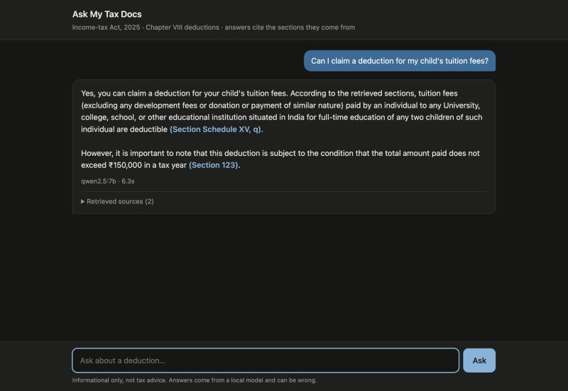

# RAG-Law — Ask My Tax Docs

A production-shaped RAG pipeline over India's Income-tax Act, 2025, built to
prove **retrieval quality engineering**, not just "call an LLM." Runs
entirely on a laptop with free, local models — no API keys.



## The problem this solves

Naive vector-only RAG on legal text confidently retrieves the wrong or
superseded section — the answer still *reads* fluently, because retrieval
failures don't show up in fluency. A layperson asking "can I claim this
deduction?" and getting a confidently wrong answer has real financial
consequences.

It matters more than usual here: the Income-tax Act, 2025 replaced the 1961
Act and renumbered everything (the old "Section 80C" is now Section 123 +
Schedule XV). A general-purpose chatbot answering from training data can mix
the two Acts. This system answers only from the 2025 text, cites the section
for every claim, refuses when the retrieved text doesn't cover the question,
and has an eval that measures whether it actually retrieved the right
section.

## Results

From [`eval/run_eval.py`](eval/run_eval.py) on the 14-question test set
([`eval/testset.jsonl`](eval/testset.jsonl)): 10 Chapter VIII questions
grounded in the Act's text, plus 4 out-of-scope questions (GST, IPC, company
registration, cricket) that must be refused.

| Metric | Score | Gate | How it's measured |
|---|---|---|---|
| Retrieval hit rate | **1.00** | 0.80 | Expected section is in the retrieved context (deterministic) |
| MRR | **0.83** | 0.60 | Rank of the first expected section (deterministic) |
| Faithfulness | **0.95** | 0.80 | Every claim supported by the context (local LLM judge) |
| Correctness | **0.80** | 0.60 | Agrees with the reference answer (local LLM judge) |
| Out-of-scope refusal | **1.00** | 0.75 | Answers with the refusal line (deterministic) |

Two of the ten in-scope questions are still refused even though the right
section was retrieved (s.122(2), and "can a company claim under s.123?") —
the 7B model is conservative with provisions that say "this Chapter" rather
than naming it. They're left in the set as known failures rather than tuned
away.

### What the eval caught

Each of these passed every "does it run" check and returned fluent answers.
The eval is what surfaced them:

| Bug | Symptom | Fix |
|---|---|---|
| Keyword search ANDed every query term | Any word absent from the statute ("available", "premium" vs. the Act's "premia") returned **zero** keyword hits, silently turning hybrid retrieval into vector-only | OR the terms; `ts_rank_cd` still ranks fuller matches higher ([`db.py`](rag_core/db.py)) |
| IVFFlat index at default `probes = 1` | Vector search scanned ~1% of the index and returned 12 of 20 requested hits; Section 123 was never scanned | `SET ivfflat.probes = 20` per connection |
| All 16 Schedules chunked as "Section 536" | 477 chunks of Schedules labelled *Repeal and savings*; tuition fees (Schedule XV) were unreachable and s.536 polluted most result lists | Chunk Schedules as their own units, with "see Section 123" in the header ([`chunking.py`](rag_core/chunking.py)) |
| Schedule crowded out its governing section | For "life insurance premium", all 4 context slots went to Schedule XV — the ₹1,50,000 cap in Section 123 never reached the model | Max 2 chunks per section, and pull in the governing section whenever a Schedule chunk is retrieved |
| Chapter name missing from chunk headers | s.122(2) ("deductions under *this Chapter*…") lost to s.198, which literally says "Chapter VIII" | Chapter in every section header |

## Architecture

```
                 ┌─────────────┐      POST /api/query       ┌──────────────────┐
   browser ───▶  │  Node API    │ ─────────────────────────▶ │  Python RAG core  │
   (chat UI)     │  (Express)   │ ◀───────────────────────── │  (FastAPI)        │
                 │  thin layer: │        JSON response        │  hybrid retrieval│
                 │  validation, │                              │  + rerank        │
                 │  rate limit, │                              │  + generation ───┼──▶ Ollama
                 │  static UI   │                              └─────────┬────────┘   (local LLM)
                 └─────────────┘                                        │
                                                          ┌──────────────┴──────────────┐
                                                          │        Postgres              │
                                                          │  pgvector  (cosine ANN)       │
                                                          │  tsvector  (keyword / FTS)    │
                                                          └───────────────────────────────┘
```

| Stage | Default (free, local) | Optional paid backend |
|---|---|---|
| Embeddings | `BAAI/bge-small-en-v1.5` (384-dim) | OpenAI `text-embedding-3-small` |
| Reranking | `BAAI/bge-reranker-base` cross-encoder | Cohere Rerank |
| Generation | `qwen2.5:7b` via Ollama | Anthropic Claude |
| Eval judge | same Ollama model | — |

Backends are picked by model name in `.env` (`text-embedding-*`, `rerank-*`,
`claude-*` select the paid ones), so switching needs no code change.

- **`rag_core/`** (Python) — chunking, embeddings, hybrid retrieval,
  reranking, grounded generation.
- **`api/`** (Node.js + Express) — thin proxy plus the chat UI: request
  validation, rate limiting, error shaping. No retrieval or generation logic
  lives here on purpose.
- **`eval/`** — the quality gate, run against the *running* API rather than
  internal functions.

### Why hybrid retrieval, not just vector search

Vector search finds semantically similar text but is blind to exact
statutory anchors — a query for a section number or a rupee figure embeds
close to a dozen unrelated deduction sections. Keyword search nails exact
terms and numbers but misses paraphrase ("tax break for LIC premium" vs.
"life insurance premia"). [`retrieval.py`](rag_core/retrieval.py) runs both
(pgvector cosine search + Postgres `tsvector`/`ts_rank_cd`) and fuses the
two *rankings* with Reciprocal Rank Fusion (k = 60) rather than their raw
scores, which live on incomparable scales. [`reranker.py`](rag_core/reranker.py)
then scores the top 20 fused candidates with a cross-encoder — RRF only
knows the two signals agree, not that a chunk is actually about the right
sub-section — and chunks scoring below 0.1 are dropped. If nothing clears
that bar, the service refuses without calling the LLM.

### Why section-aware chunking

[`chunking.py`](rag_core/chunking.py) splits on the Act's own structure
(section → sub-section → clause; Schedule → paragraph) instead of a fixed
token window, which will happily cut "...the deduction under this section
shall not exceed" away from the number that follows it. Every chunk carries
a header naming its section, chapter and title, so part 3 of 7 is still
self-describing. The 686-page corpus yields 2,817 chunks (avg 160 tokens).

### Why the eval is the actual deliverable

[`run_eval.py`](eval/run_eval.py) scores retrieval **deterministically** —
did the expected section come back, and at what rank — so the retrieval half
of the gate has no judge noise at all. Answers are graded by a local LLM
judge for faithfulness and correctness, and out-of-scope questions must be
refused. It exits non-zero below threshold, so a retrieval regression fails
CI like a broken unit test would.

(It replaced an earlier Ragas-based eval: Ragas's current release imports
LangChain modules removed from the versions the chunker needs, and its
multi-step judge prompts are brittle with small local models.)

## Running it locally

Needs Python 3.12+, Node 20+, Postgres 16 with
[pgvector](https://github.com/pgvector/pgvector), and
[Ollama](https://ollama.com). On macOS:

```bash
brew install ollama && brew services start ollama
ollama pull qwen2.5:7b                     # ~4.7 GB; qwen2.5:3b is a lighter option

cp .env.example .env                       # defaults are the free local stack
docker compose up -d db                    # or point DATABASE_URL at a local Postgres

python -m venv venv && source venv/bin/activate
pip install -r requirements.txt
python scripts/ingest.py --reset           # PDF -> chunks -> embeddings -> Postgres

uvicorn rag_core.service:app --port 8000   # RAG core
cd api && npm install && npm start         # API + chat UI, in another shell
```

Open **http://localhost:3000** for the chat UI, or call the API directly:

```bash
curl -X POST http://localhost:3000/api/query \
  -H "Content-Type: application/json" \
  -d '{"question": "Can I claim a deduction for my child'\''s tuition fees?"}'
```

Run the eval gate against the running stack:

```bash
python eval/run_eval.py
```

In CI the same gate runs from the Actions tab (**Run workflow**) —
[`.github/workflows/eval.yml`](.github/workflows/eval.yml) installs Ollama on
the runner, so it needs no secrets. It's manual-only because each run pulls a
multi-GB model and runs CPU inference.

## Scope

The whole Act (686 pages, all chapters and Schedules) is ingested, but the
test set and tuning target **Chapter VIII — Deductions (Sections 122–154)**.
Other chapters will answer, with less evidence that they answer well. It
doesn't cover other laws, the Income-tax Rules, CBDT circulars or case law,
and it's informational, not tax advice.

## Known limitations

- **Small test set.** 14 questions is enough to catch regressions like the
  ones above, not to make claims about overall accuracy.
- **Self-grading.** The judge defaults to the same 7B model that writes the
  answers, which can be lenient toward its own phrasing. Set `JUDGE_MODEL`
  to a different Ollama model to reduce that bias. The retrieval metrics
  don't depend on it.
- **Conservative refusals.** See the two in-scope misses under Results.
- **Heuristic structure detection.** Section boundaries use a
  monotonic-number heuristic and assume the Act is scanned in order
  (documented in `chunking.py`).
- **Tables as text.** Rate tables are chunked as ordinary text; a table
  extractor would be needed for table lookups.
- **Prompt-level guardrail.** Refusal on insufficient context is enforced by
  a relevance threshold plus the prompt, not a formal groundedness
  classifier.
